# Capstone Project
## Overview

If you are planning on going out to see a movie, how well can you trust online reviews and ratings? *Especially* if the same company showing the rating *also* makes money by selling movie tickets. Do they have a bias towards rating movies higher than they should be rated?

### Goal:

**To determine if Fandango's ratings in 2015 had a bias towards rating movies better to sell more tickets.**


```python
# Imports
import numpy as np
import pandas as pd
import matplotlib.pyplot as plt
import seaborn as sns
```

## Exploring Fandango Displayed Scores versus True User Ratings

First exploring the Fandango ratings to see if our analysis agrees with the article's conclusion.


```python
fandango = pd.read_csv("fandango_scrape.csv")
fandango.head()
```


<div>
<style scoped>
    .dataframe tbody tr th:only-of-type {
        vertical-align: middle;
    }

    .dataframe tbody tr th {
        vertical-align: top;
    }

    .dataframe thead th {
        text-align: right;
    }
</style>
<table border="1" class="dataframe">
  <thead>
    <tr style="text-align: right;">
      <th></th>
      <th>FILM</th>
      <th>STARS</th>
      <th>RATING</th>
      <th>VOTES</th>
    </tr>
  </thead>
  <tbody>
    <tr>
      <th>0</th>
      <td>Fifty Shades of Grey (2015)</td>
      <td>4.0</td>
      <td>3.9</td>
      <td>34846</td>
    </tr>
    <tr>
      <th>1</th>
      <td>Jurassic World (2015)</td>
      <td>4.5</td>
      <td>4.5</td>
      <td>34390</td>
    </tr>
    <tr>
      <th>2</th>
      <td>American Sniper (2015)</td>
      <td>5.0</td>
      <td>4.8</td>
      <td>34085</td>
    </tr>
    <tr>
      <th>3</th>
      <td>Furious 7 (2015)</td>
      <td>5.0</td>
      <td>4.8</td>
      <td>33538</td>
    </tr>
    <tr>
      <th>4</th>
      <td>Inside Out (2015)</td>
      <td>4.5</td>
      <td>4.5</td>
      <td>15749</td>
    </tr>
  </tbody>
</table>
</div>


```python
fandango.info()
```

    <class 'pandas.core.frame.DataFrame'>
    RangeIndex: 504 entries, 0 to 503
    Data columns (total 4 columns):
     #   Column  Non-Null Count  Dtype  
    ---  ------  --------------  -----  
     0   FILM    504 non-null    object 
     1   STARS   504 non-null    float64
     2   RATING  504 non-null    float64
     3   VOTES   504 non-null    int64  
    dtypes: float64(2), int64(1), object(1)
    memory usage: 15.9+ KB


```python
fandango.describe()
```


<div>
<style scoped>
    .dataframe tbody tr th:only-of-type {
        vertical-align: middle;
    }

    .dataframe tbody tr th {
        vertical-align: top;
    }

    .dataframe thead th {
        text-align: right;
    }
</style>
<table border="1" class="dataframe">
  <thead>
    <tr style="text-align: right;">
      <th></th>
      <th>STARS</th>
      <th>RATING</th>
      <th>VOTES</th>
    </tr>
  </thead>
  <tbody>
    <tr>
      <th>count</th>
      <td>504.000000</td>
      <td>504.000000</td>
      <td>504.000000</td>
    </tr>
    <tr>
      <th>mean</th>
      <td>3.558532</td>
      <td>3.375794</td>
      <td>1147.863095</td>
    </tr>
    <tr>
      <th>std</th>
      <td>1.563133</td>
      <td>1.491223</td>
      <td>3830.583136</td>
    </tr>
    <tr>
      <th>min</th>
      <td>0.000000</td>
      <td>0.000000</td>
      <td>0.000000</td>
    </tr>
    <tr>
      <th>25%</th>
      <td>3.500000</td>
      <td>3.100000</td>
      <td>3.000000</td>
    </tr>
    <tr>
      <th>50%</th>
      <td>4.000000</td>
      <td>3.800000</td>
      <td>18.500000</td>
    </tr>
    <tr>
      <th>75%</th>
      <td>4.500000</td>
      <td>4.300000</td>
      <td>189.750000</td>
    </tr>
    <tr>
      <th>max</th>
      <td>5.000000</td>
      <td>5.000000</td>
      <td>34846.000000</td>
    </tr>
  </tbody>
</table>
</div>


**Exploring the relationship between popularity of a film and its rating. Below is a scatterplot showing the relationship between rating and votes.**


```python
# CODE HERE
plt.figure(figsize=(10,4), dpi=200)

sns.scatterplot(data=fandango, x='RATING', y='VOTES')

plt.show()
```


    
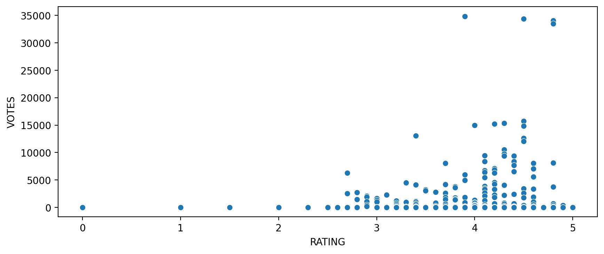
    


**Calculating the correlation between the columns:**


```python
fandango.corr()
```


<div>
<style scoped>
    .dataframe tbody tr th:only-of-type {
        vertical-align: middle;
    }

    .dataframe tbody tr th {
        vertical-align: top;
    }

    .dataframe thead th {
        text-align: right;
    }
</style>
<table border="1" class="dataframe">
  <thead>
    <tr style="text-align: right;">
      <th></th>
      <th>STARS</th>
      <th>RATING</th>
      <th>VOTES</th>
    </tr>
  </thead>
  <tbody>
    <tr>
      <th>STARS</th>
      <td>1.000000</td>
      <td>0.994696</td>
      <td>0.164218</td>
    </tr>
    <tr>
      <th>RATING</th>
      <td>0.994696</td>
      <td>1.000000</td>
      <td>0.163764</td>
    </tr>
    <tr>
      <th>VOTES</th>
      <td>0.164218</td>
      <td>0.163764</td>
      <td>1.000000</td>
    </tr>
  </tbody>
</table>
</div>


```python

```

**Assuming that every row in the FILM title column has the same format:**

    Film Title Name (Year)
    
**Creating a new column that is able to strip the year from the title strings and set this new column as YEAR**


```python
fandango['YEAR'] = fandango['FILM'].apply(lambda title: title.split(' ')[-1][1:-1])
fandango['YEAR']
```


    0      2015
    1      2015
    2      2015
    3      2015
    4      2015
           ... 
    499    2015
    500    2015
    501    2015
    502    1964
    503    2012
    Name: YEAR, Length: 504, dtype: object


**Displaying how many movies are in the Fandango DataFrame per year.**


```python
#CODE HERE
fandango['YEAR'].value_counts()
```


    2015    478
    2014     23
    1964      1
    2016      1
    2012      1
    Name: YEAR, dtype: int64


**Count of movies per year with a count plot:**


```python
sns.countplot(data=fandango, x='YEAR')
```


    <AxesSubplot:xlabel='YEAR', ylabel='count'>


    

    


**The 10 movies with the highest number of votes.**


```python
fandango.nlargest(10, 'VOTES')
```


<div>
<style scoped>
    .dataframe tbody tr th:only-of-type {
        vertical-align: middle;
    }

    .dataframe tbody tr th {
        vertical-align: top;
    }

    .dataframe thead th {
        text-align: right;
    }
</style>
<table border="1" class="dataframe">
  <thead>
    <tr style="text-align: right;">
      <th></th>
      <th>FILM</th>
      <th>STARS</th>
      <th>RATING</th>
      <th>VOTES</th>
      <th>YEAR</th>
    </tr>
  </thead>
  <tbody>
    <tr>
      <th>0</th>
      <td>Fifty Shades of Grey (2015)</td>
      <td>4.0</td>
      <td>3.9</td>
      <td>34846</td>
      <td>2015</td>
    </tr>
    <tr>
      <th>1</th>
      <td>Jurassic World (2015)</td>
      <td>4.5</td>
      <td>4.5</td>
      <td>34390</td>
      <td>2015</td>
    </tr>
    <tr>
      <th>2</th>
      <td>American Sniper (2015)</td>
      <td>5.0</td>
      <td>4.8</td>
      <td>34085</td>
      <td>2015</td>
    </tr>
    <tr>
      <th>3</th>
      <td>Furious 7 (2015)</td>
      <td>5.0</td>
      <td>4.8</td>
      <td>33538</td>
      <td>2015</td>
    </tr>
    <tr>
      <th>4</th>
      <td>Inside Out (2015)</td>
      <td>4.5</td>
      <td>4.5</td>
      <td>15749</td>
      <td>2015</td>
    </tr>
    <tr>
      <th>5</th>
      <td>The Hobbit: The Battle of the Five Armies (2014)</td>
      <td>4.5</td>
      <td>4.3</td>
      <td>15337</td>
      <td>2014</td>
    </tr>
    <tr>
      <th>6</th>
      <td>Kingsman: The Secret Service (2015)</td>
      <td>4.5</td>
      <td>4.2</td>
      <td>15205</td>
      <td>2015</td>
    </tr>
    <tr>
      <th>7</th>
      <td>Minions (2015)</td>
      <td>4.0</td>
      <td>4.0</td>
      <td>14998</td>
      <td>2015</td>
    </tr>
    <tr>
      <th>8</th>
      <td>Avengers: Age of Ultron (2015)</td>
      <td>5.0</td>
      <td>4.5</td>
      <td>14846</td>
      <td>2015</td>
    </tr>
    <tr>
      <th>9</th>
      <td>Into the Woods (2014)</td>
      <td>3.5</td>
      <td>3.4</td>
      <td>13055</td>
      <td>2014</td>
    </tr>
  </tbody>
</table>
</div>


**Movies with zero votes.**


```python
len(fandango[fandango['VOTES'] == 0])
```


    69


**DataFrame of only reviewed films by removing any films that have zero votes.**


```python
df_no_zeros = fandango[fandango['VOTES'] > 0]
df_no_zeros.head()
```


<div>
<style scoped>
    .dataframe tbody tr th:only-of-type {
        vertical-align: middle;
    }

    .dataframe tbody tr th {
        vertical-align: top;
    }

    .dataframe thead th {
        text-align: right;
    }
</style>
<table border="1" class="dataframe">
  <thead>
    <tr style="text-align: right;">
      <th></th>
      <th>FILM</th>
      <th>STARS</th>
      <th>RATING</th>
      <th>VOTES</th>
      <th>YEAR</th>
    </tr>
  </thead>
  <tbody>
    <tr>
      <th>0</th>
      <td>Fifty Shades of Grey (2015)</td>
      <td>4.0</td>
      <td>3.9</td>
      <td>34846</td>
      <td>2015</td>
    </tr>
    <tr>
      <th>1</th>
      <td>Jurassic World (2015)</td>
      <td>4.5</td>
      <td>4.5</td>
      <td>34390</td>
      <td>2015</td>
    </tr>
    <tr>
      <th>2</th>
      <td>American Sniper (2015)</td>
      <td>5.0</td>
      <td>4.8</td>
      <td>34085</td>
      <td>2015</td>
    </tr>
    <tr>
      <th>3</th>
      <td>Furious 7 (2015)</td>
      <td>5.0</td>
      <td>4.8</td>
      <td>33538</td>
      <td>2015</td>
    </tr>
    <tr>
      <th>4</th>
      <td>Inside Out (2015)</td>
      <td>4.5</td>
      <td>4.5</td>
      <td>15749</td>
      <td>2015</td>
    </tr>
  </tbody>
</table>
</div>


----

**Due to HTML and star rating displays, the true user rating may be slightly different than the rating shown to a user. Let's visualize this difference in distributions.**

**Here are KDE plots that display the distribution of ratings that are displayed to users via HTML (STARS) versus what the true rating was from votes (RATING).**


```python
plt.figure(figsize=(10,4), dpi=150)

sns.kdeplot(data=df_no_zeros, x='RATING', shade=True, label='True Rating', clip=[0,5])
sns.kdeplot(data=df_no_zeros, x='STARS', shade=True, label='Stars Displayed', clip=[0,5])

plt.legend(loc=(1.05,0.5))
plt.show()
```


    
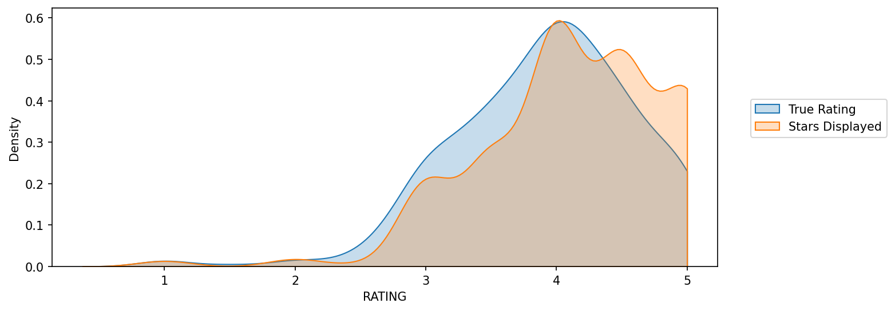
    


**Time to quantify this discrepancy. Start by creating a new column of the different between STARS displayed versus true RATING. This difference will be calculated as STARS-RATING and rounding these differences to the nearest decimal point.**


```python
df_no_zeros['STARS_DIFF'] = round(df_no_zeros['STARS'] - df_no_zeros['RATING'], 1)
df_no_zeros
```

    <ipython-input-64-c5b2fa41169f>:1: SettingWithCopyWarning: 
    A value is trying to be set on a copy of a slice from a DataFrame.
    Try using .loc[row_indexer,col_indexer] = value instead
    
    See the caveats in the documentation: https://pandas.pydata.org/pandas-docs/stable/user_guide/indexing.html#returning-a-view-versus-a-copy
      df_no_zeros['STARS_DIFF'] = round(df_no_zeros['STARS'] - df_no_zeros['RATING'], 1)


<div>
<style scoped>
    .dataframe tbody tr th:only-of-type {
        vertical-align: middle;
    }

    .dataframe tbody tr th {
        vertical-align: top;
    }

    .dataframe thead th {
        text-align: right;
    }
</style>
<table border="1" class="dataframe">
  <thead>
    <tr style="text-align: right;">
      <th></th>
      <th>FILM</th>
      <th>STARS</th>
      <th>RATING</th>
      <th>VOTES</th>
      <th>YEAR</th>
      <th>STARS_DIFF</th>
    </tr>
  </thead>
  <tbody>
    <tr>
      <th>0</th>
      <td>Fifty Shades of Grey (2015)</td>
      <td>4.0</td>
      <td>3.9</td>
      <td>34846</td>
      <td>2015</td>
      <td>0.1</td>
    </tr>
    <tr>
      <th>1</th>
      <td>Jurassic World (2015)</td>
      <td>4.5</td>
      <td>4.5</td>
      <td>34390</td>
      <td>2015</td>
      <td>0.0</td>
    </tr>
    <tr>
      <th>2</th>
      <td>American Sniper (2015)</td>
      <td>5.0</td>
      <td>4.8</td>
      <td>34085</td>
      <td>2015</td>
      <td>0.2</td>
    </tr>
    <tr>
      <th>3</th>
      <td>Furious 7 (2015)</td>
      <td>5.0</td>
      <td>4.8</td>
      <td>33538</td>
      <td>2015</td>
      <td>0.2</td>
    </tr>
    <tr>
      <th>4</th>
      <td>Inside Out (2015)</td>
      <td>4.5</td>
      <td>4.5</td>
      <td>15749</td>
      <td>2015</td>
      <td>0.0</td>
    </tr>
    <tr>
      <th>...</th>
      <td>...</td>
      <td>...</td>
      <td>...</td>
      <td>...</td>
      <td>...</td>
      <td>...</td>
    </tr>
    <tr>
      <th>430</th>
      <td>That Sugar Film (2015)</td>
      <td>5.0</td>
      <td>5.0</td>
      <td>1</td>
      <td>2015</td>
      <td>0.0</td>
    </tr>
    <tr>
      <th>431</th>
      <td>The Intern (2015)</td>
      <td>5.0</td>
      <td>5.0</td>
      <td>1</td>
      <td>2015</td>
      <td>0.0</td>
    </tr>
    <tr>
      <th>432</th>
      <td>The Park Bench (2015)</td>
      <td>5.0</td>
      <td>5.0</td>
      <td>1</td>
      <td>2015</td>
      <td>0.0</td>
    </tr>
    <tr>
      <th>433</th>
      <td>The Wanted 18 (2015)</td>
      <td>5.0</td>
      <td>5.0</td>
      <td>1</td>
      <td>2015</td>
      <td>0.0</td>
    </tr>
    <tr>
      <th>434</th>
      <td>Z For Zachariah (2015)</td>
      <td>5.0</td>
      <td>5.0</td>
      <td>1</td>
      <td>2015</td>
      <td>0.0</td>
    </tr>
  </tbody>
</table>
<p>435 rows × 6 columns</p>
</div>


**Here is a count plot to display the number of times a certain difference occurs:**


```python
plt.figure(figsize=(10,4), dpi=200)
sns.countplot(data=df_no_zeros, x='STARS_DIFF', palette='magma')
```


    <AxesSubplot:xlabel='STARS_DIFF', ylabel='count'>


    
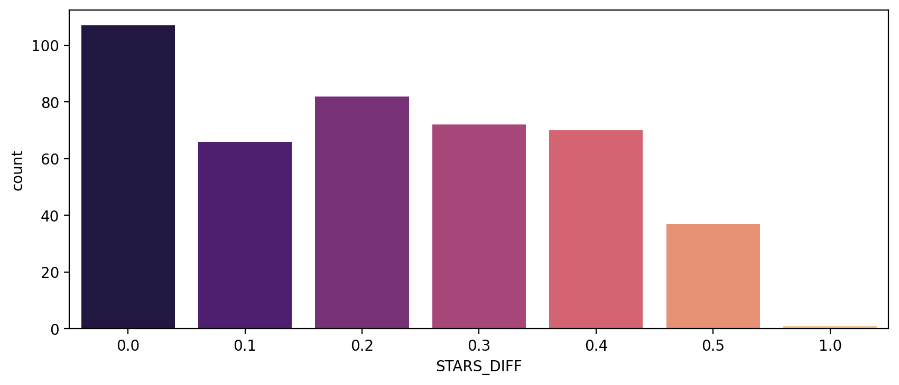
    


**Only one movie was displaying over a 1 star difference than its true rating! Here is that movie.**


```python
df_no_zeros[df_no_zeros['STARS_DIFF'] == 1.0]
```


<div>
<style scoped>
    .dataframe tbody tr th:only-of-type {
        vertical-align: middle;
    }

    .dataframe tbody tr th {
        vertical-align: top;
    }

    .dataframe thead th {
        text-align: right;
    }
</style>
<table border="1" class="dataframe">
  <thead>
    <tr style="text-align: right;">
      <th></th>
      <th>FILM</th>
      <th>STARS</th>
      <th>RATING</th>
      <th>VOTES</th>
      <th>YEAR</th>
      <th>STARS_DIFF</th>
    </tr>
  </thead>
  <tbody>
    <tr>
      <th>381</th>
      <td>Turbo Kid (2015)</td>
      <td>5.0</td>
      <td>4.0</td>
      <td>2</td>
      <td>2015</td>
      <td>1.0</td>
    </tr>
  </tbody>
</table>
</div>


## Comparing the scores from Fandango to other movies sites and see how they compare.


```python
all_sites = pd.read_csv("all_sites_scores.csv")
```


```python
all_sites.head()
```


<div>
<style scoped>
    .dataframe tbody tr th:only-of-type {
        vertical-align: middle;
    }

    .dataframe tbody tr th {
        vertical-align: top;
    }

    .dataframe thead th {
        text-align: right;
    }
</style>
<table border="1" class="dataframe">
  <thead>
    <tr style="text-align: right;">
      <th></th>
      <th>FILM</th>
      <th>RottenTomatoes</th>
      <th>RottenTomatoes_User</th>
      <th>Metacritic</th>
      <th>Metacritic_User</th>
      <th>IMDB</th>
      <th>Metacritic_user_vote_count</th>
      <th>IMDB_user_vote_count</th>
    </tr>
  </thead>
  <tbody>
    <tr>
      <th>0</th>
      <td>Avengers: Age of Ultron (2015)</td>
      <td>74</td>
      <td>86</td>
      <td>66</td>
      <td>7.1</td>
      <td>7.8</td>
      <td>1330</td>
      <td>271107</td>
    </tr>
    <tr>
      <th>1</th>
      <td>Cinderella (2015)</td>
      <td>85</td>
      <td>80</td>
      <td>67</td>
      <td>7.5</td>
      <td>7.1</td>
      <td>249</td>
      <td>65709</td>
    </tr>
    <tr>
      <th>2</th>
      <td>Ant-Man (2015)</td>
      <td>80</td>
      <td>90</td>
      <td>64</td>
      <td>8.1</td>
      <td>7.8</td>
      <td>627</td>
      <td>103660</td>
    </tr>
    <tr>
      <th>3</th>
      <td>Do You Believe? (2015)</td>
      <td>18</td>
      <td>84</td>
      <td>22</td>
      <td>4.7</td>
      <td>5.4</td>
      <td>31</td>
      <td>3136</td>
    </tr>
    <tr>
      <th>4</th>
      <td>Hot Tub Time Machine 2 (2015)</td>
      <td>14</td>
      <td>28</td>
      <td>29</td>
      <td>3.4</td>
      <td>5.1</td>
      <td>88</td>
      <td>19560</td>
    </tr>
  </tbody>
</table>
</div>


```python
all_sites.info()
```

    <class 'pandas.core.frame.DataFrame'>
    RangeIndex: 146 entries, 0 to 145
    Data columns (total 8 columns):
     #   Column                      Non-Null Count  Dtype  
    ---  ------                      --------------  -----  
     0   FILM                        146 non-null    object 
     1   RottenTomatoes              146 non-null    int64  
     2   RottenTomatoes_User         146 non-null    int64  
     3   Metacritic                  146 non-null    int64  
     4   Metacritic_User             146 non-null    float64
     5   IMDB                        146 non-null    float64
     6   Metacritic_user_vote_count  146 non-null    int64  
     7   IMDB_user_vote_count        146 non-null    int64  
    dtypes: float64(2), int64(5), object(1)
    memory usage: 9.2+ KB


```python
all_sites.describe()
```


<div>
<style scoped>
    .dataframe tbody tr th:only-of-type {
        vertical-align: middle;
    }

    .dataframe tbody tr th {
        vertical-align: top;
    }

    .dataframe thead th {
        text-align: right;
    }
</style>
<table border="1" class="dataframe">
  <thead>
    <tr style="text-align: right;">
      <th></th>
      <th>RottenTomatoes</th>
      <th>RottenTomatoes_User</th>
      <th>Metacritic</th>
      <th>Metacritic_User</th>
      <th>IMDB</th>
      <th>Metacritic_user_vote_count</th>
      <th>IMDB_user_vote_count</th>
    </tr>
  </thead>
  <tbody>
    <tr>
      <th>count</th>
      <td>146.000000</td>
      <td>146.000000</td>
      <td>146.000000</td>
      <td>146.000000</td>
      <td>146.000000</td>
      <td>146.000000</td>
      <td>146.000000</td>
    </tr>
    <tr>
      <th>mean</th>
      <td>60.849315</td>
      <td>63.876712</td>
      <td>58.808219</td>
      <td>6.519178</td>
      <td>6.736986</td>
      <td>185.705479</td>
      <td>42846.205479</td>
    </tr>
    <tr>
      <th>std</th>
      <td>30.168799</td>
      <td>20.024430</td>
      <td>19.517389</td>
      <td>1.510712</td>
      <td>0.958736</td>
      <td>316.606515</td>
      <td>67406.509171</td>
    </tr>
    <tr>
      <th>min</th>
      <td>5.000000</td>
      <td>20.000000</td>
      <td>13.000000</td>
      <td>2.400000</td>
      <td>4.000000</td>
      <td>4.000000</td>
      <td>243.000000</td>
    </tr>
    <tr>
      <th>25%</th>
      <td>31.250000</td>
      <td>50.000000</td>
      <td>43.500000</td>
      <td>5.700000</td>
      <td>6.300000</td>
      <td>33.250000</td>
      <td>5627.000000</td>
    </tr>
    <tr>
      <th>50%</th>
      <td>63.500000</td>
      <td>66.500000</td>
      <td>59.000000</td>
      <td>6.850000</td>
      <td>6.900000</td>
      <td>72.500000</td>
      <td>19103.000000</td>
    </tr>
    <tr>
      <th>75%</th>
      <td>89.000000</td>
      <td>81.000000</td>
      <td>75.000000</td>
      <td>7.500000</td>
      <td>7.400000</td>
      <td>168.500000</td>
      <td>45185.750000</td>
    </tr>
    <tr>
      <th>max</th>
      <td>100.000000</td>
      <td>94.000000</td>
      <td>94.000000</td>
      <td>9.600000</td>
      <td>8.600000</td>
      <td>2375.000000</td>
      <td>334164.000000</td>
    </tr>
  </tbody>
</table>
</div>


### Rotten Tomatoes

Let's first take a look at Rotten Tomatoes. RT has two sets of reviews, their critics reviews (ratings published by official critics) and user reviews. 

**Below is a scatterplot exploring the relationship between RT Critic reviews and RT User reviews.**


```python
plt.figure(figsize=(10,4), dpi=150)
sns.scatterplot(data=all_sites, x='RottenTomatoes', y='RottenTomatoes_User')
plt.xlim(0,100)
plt.ylim(0,100)

plt.show()
```


    
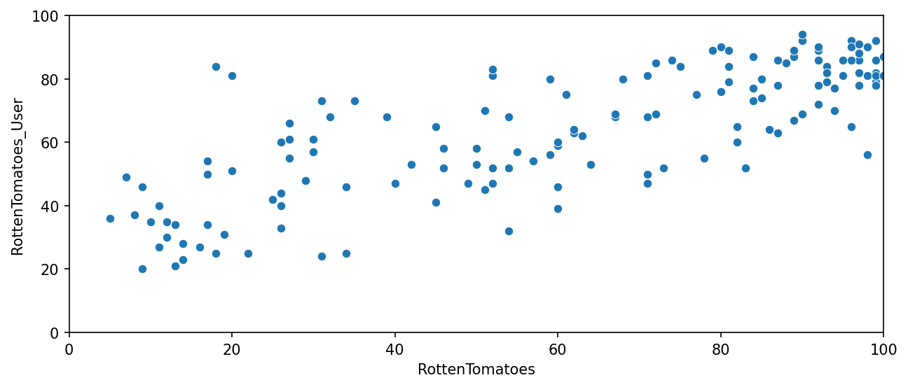
    


Let's quantify this difference by comparing the critics ratings and the RT User ratings. We will calculate this with RottenTomatoes-RottenTomatoes_User. Note: Rotten_Diff here is Critics - User Score. So values closer to 0 means aggrement between Critics and Users. Larger positive values means critics rated much higher than users. Larger negative values means users rated much higher than critics.

**We will create a new column based off the difference between critics ratings and users ratings for Rotten Tomatoes. Calculate this with RottenTomatoes-RottenTomatoes_User**


```python
all_sites['Rotten_Diff'] = all_sites['RottenTomatoes'] - all_sites['RottenTomatoes_User']
all_sites.head()
```


<div>
<style scoped>
    .dataframe tbody tr th:only-of-type {
        vertical-align: middle;
    }

    .dataframe tbody tr th {
        vertical-align: top;
    }

    .dataframe thead th {
        text-align: right;
    }
</style>
<table border="1" class="dataframe">
  <thead>
    <tr style="text-align: right;">
      <th></th>
      <th>FILM</th>
      <th>RottenTomatoes</th>
      <th>RottenTomatoes_User</th>
      <th>Metacritic</th>
      <th>Metacritic_User</th>
      <th>IMDB</th>
      <th>Metacritic_user_vote_count</th>
      <th>IMDB_user_vote_count</th>
      <th>Rotten_Diff</th>
    </tr>
  </thead>
  <tbody>
    <tr>
      <th>0</th>
      <td>Avengers: Age of Ultron (2015)</td>
      <td>74</td>
      <td>86</td>
      <td>66</td>
      <td>7.1</td>
      <td>7.8</td>
      <td>1330</td>
      <td>271107</td>
      <td>-12</td>
    </tr>
    <tr>
      <th>1</th>
      <td>Cinderella (2015)</td>
      <td>85</td>
      <td>80</td>
      <td>67</td>
      <td>7.5</td>
      <td>7.1</td>
      <td>249</td>
      <td>65709</td>
      <td>5</td>
    </tr>
    <tr>
      <th>2</th>
      <td>Ant-Man (2015)</td>
      <td>80</td>
      <td>90</td>
      <td>64</td>
      <td>8.1</td>
      <td>7.8</td>
      <td>627</td>
      <td>103660</td>
      <td>-10</td>
    </tr>
    <tr>
      <th>3</th>
      <td>Do You Believe? (2015)</td>
      <td>18</td>
      <td>84</td>
      <td>22</td>
      <td>4.7</td>
      <td>5.4</td>
      <td>31</td>
      <td>3136</td>
      <td>-66</td>
    </tr>
    <tr>
      <th>4</th>
      <td>Hot Tub Time Machine 2 (2015)</td>
      <td>14</td>
      <td>28</td>
      <td>29</td>
      <td>3.4</td>
      <td>5.1</td>
      <td>88</td>
      <td>19560</td>
      <td>-14</td>
    </tr>
  </tbody>
</table>
</div>


Let's now compare the overall mean difference. Since we're dealing with differences that could be negative or positive, first take the absolute value of all the differences, then take the mean. This would report back on average to absolute difference between the critics rating versus the user rating.

**Calculating the Mean Absolute Difference between RT scores and RT User scores as described above.**


```python
abs_diff = abs(all_sites['Rotten_Diff']).mean()
abs_diff
```


    15.095890410958905


**Plotting the distribution of the differences between RT Critics Score and RT User Score. There should be negative values in this distribution plot.**


```python
plt.figure(figsize=(10,4), dpi=150)

sns.histplot(data=all_sites, x='Rotten_Diff', kde=True, bins=25)

plt.title('RT Critics Score Minus RT User Score')
plt.show()
```


    
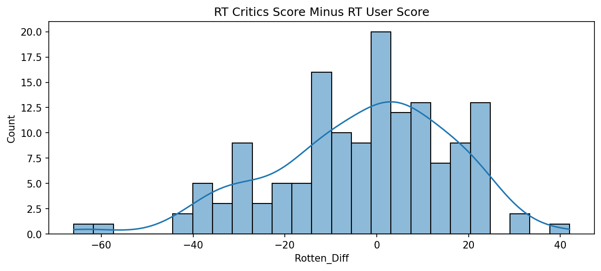
    


**Now here is a distribution showing the *absolute value* difference between Critics and Users on Rotten Tomatoes.**


```python
plt.figure(figsize=(10,4), dpi=150)

sns.histplot(x=abs(all_sites['Rotten_Diff']), kde=True, bins=25)

plt.title('Abs Difference between RT Critics Score and RT User Score')
plt.show()
```


    
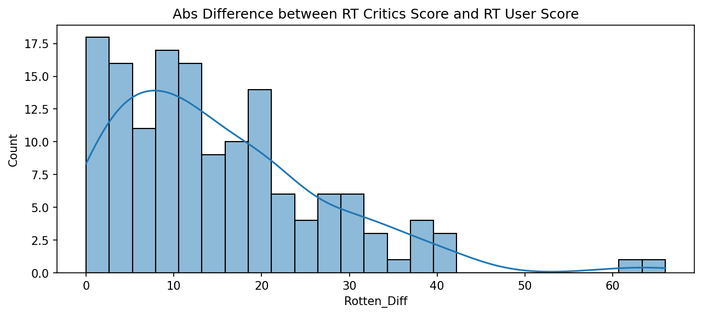
    


**Let's find out which movies are causing the largest differences.**

**Here are the top 5 movies users rated higher than critics on average:**


```python
# Looking for lowest negative values since they indicate that users of RT liked a certain movie more than critics.
print('Users love but critics hate:')
all_sites.nsmallest(5,columns='Rotten_Diff')[['FILM', 'Rotten_Diff']]
```

    Users love but critics hate:


<div>
<style scoped>
    .dataframe tbody tr th:only-of-type {
        vertical-align: middle;
    }

    .dataframe tbody tr th {
        vertical-align: top;
    }

    .dataframe thead th {
        text-align: right;
    }
</style>
<table border="1" class="dataframe">
  <thead>
    <tr style="text-align: right;">
      <th></th>
      <th>FILM</th>
      <th>Rotten_Diff</th>
    </tr>
  </thead>
  <tbody>
    <tr>
      <th>3</th>
      <td>Do You Believe? (2015)</td>
      <td>-66</td>
    </tr>
    <tr>
      <th>85</th>
      <td>Little Boy (2015)</td>
      <td>-61</td>
    </tr>
    <tr>
      <th>105</th>
      <td>Hitman: Agent 47 (2015)</td>
      <td>-42</td>
    </tr>
    <tr>
      <th>134</th>
      <td>The Longest Ride (2015)</td>
      <td>-42</td>
    </tr>
    <tr>
      <th>125</th>
      <td>The Wedding Ringer (2015)</td>
      <td>-39</td>
    </tr>
  </tbody>
</table>
</div>


**Here are the top 5 movies critics rated higher than users on average:**


```python
# Looking for largest positive values since they indicate that critics  liked a certain movie more than users of RT.
print('Critics love but users hate:')
all_sites.nlargest(5,columns='Rotten_Diff')[['FILM', 'Rotten_Diff']]
```

    Critics love but users hate:


<div>
<style scoped>
    .dataframe tbody tr th:only-of-type {
        vertical-align: middle;
    }

    .dataframe tbody tr th {
        vertical-align: top;
    }

    .dataframe thead th {
        text-align: right;
    }
</style>
<table border="1" class="dataframe">
  <thead>
    <tr style="text-align: right;">
      <th></th>
      <th>FILM</th>
      <th>Rotten_Diff</th>
    </tr>
  </thead>
  <tbody>
    <tr>
      <th>69</th>
      <td>Mr. Turner (2014)</td>
      <td>42</td>
    </tr>
    <tr>
      <th>112</th>
      <td>It Follows (2015)</td>
      <td>31</td>
    </tr>
    <tr>
      <th>115</th>
      <td>While We're Young (2015)</td>
      <td>31</td>
    </tr>
    <tr>
      <th>37</th>
      <td>Welcome to Me (2015)</td>
      <td>24</td>
    </tr>
    <tr>
      <th>40</th>
      <td>I'll See You In My Dreams (2015)</td>
      <td>24</td>
    </tr>
  </tbody>
</table>
</div>


```python

```

## MetaCritic

Now let's take a quick look at the ratings from MetaCritic. Metacritic also shows an average user rating versus their official displayed rating.

**Below is a scatterplot of the Metacritic Rating versus the Metacritic User rating.**


```python
plt.figure(figsize=(10,4), dpi=150)

sns.scatterplot(data=all_sites, x='Metacritic', y='Metacritic_User')

plt.xlim(0,100)
plt.ylim(0,10)
plt.show()
```


    
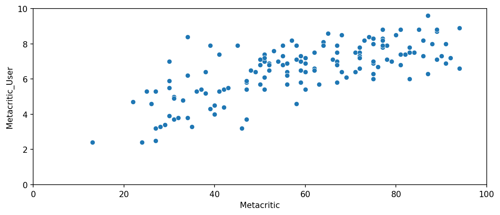
    


```python

```

## IMDB

Finally let's explore IMDB. Notice that both Metacritic and IMDB report back vote counts. Let's analyze the most popular movies.

**Below is a scatterplot for the relationship between vote counts on MetaCritic versus vote counts on IMDB for a specific movie.**


```python
plt.figure(figsize=(10,4), dpi=150)

sns.scatterplot(data=all_sites, x='Metacritic_user_vote_count', y='IMDB_user_vote_count')

plt.show()
```


    
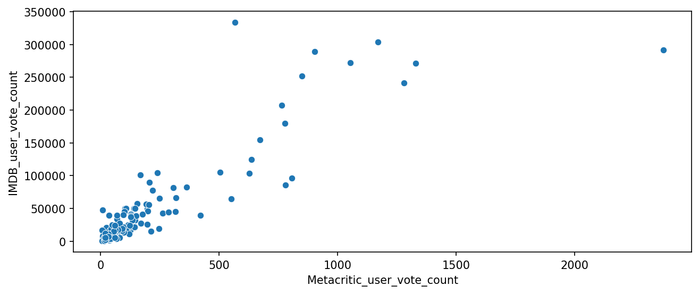
    


**Notice there are two outliers here. The movie with the highest vote count on IMDB only has about 500 Metacritic ratings. Here is that movie?**


```python
all_sites.nlargest(1, 'IMDB_user_vote_count')
```


<div>
<style scoped>
    .dataframe tbody tr th:only-of-type {
        vertical-align: middle;
    }

    .dataframe tbody tr th {
        vertical-align: top;
    }

    .dataframe thead th {
        text-align: right;
    }
</style>
<table border="1" class="dataframe">
  <thead>
    <tr style="text-align: right;">
      <th></th>
      <th>FILM</th>
      <th>RottenTomatoes</th>
      <th>RottenTomatoes_User</th>
      <th>Metacritic</th>
      <th>Metacritic_User</th>
      <th>IMDB</th>
      <th>Metacritic_user_vote_count</th>
      <th>IMDB_user_vote_count</th>
      <th>Rotten_Diff</th>
    </tr>
  </thead>
  <tbody>
    <tr>
      <th>14</th>
      <td>The Imitation Game (2014)</td>
      <td>90</td>
      <td>92</td>
      <td>73</td>
      <td>8.2</td>
      <td>8.1</td>
      <td>566</td>
      <td>334164</td>
      <td>-2</td>
    </tr>
  </tbody>
</table>
</div>


**Here is the movie that has the highest Metacritic User Vote count?**


```python
all_sites.nlargest(1, 'Metacritic_user_vote_count')
```


<div>
<style scoped>
    .dataframe tbody tr th:only-of-type {
        vertical-align: middle;
    }

    .dataframe tbody tr th {
        vertical-align: top;
    }

    .dataframe thead th {
        text-align: right;
    }
</style>
<table border="1" class="dataframe">
  <thead>
    <tr style="text-align: right;">
      <th></th>
      <th>FILM</th>
      <th>RottenTomatoes</th>
      <th>RottenTomatoes_User</th>
      <th>Metacritic</th>
      <th>Metacritic_User</th>
      <th>IMDB</th>
      <th>Metacritic_user_vote_count</th>
      <th>IMDB_user_vote_count</th>
      <th>Rotten_Diff</th>
    </tr>
  </thead>
  <tbody>
    <tr>
      <th>88</th>
      <td>Mad Max: Fury Road (2015)</td>
      <td>97</td>
      <td>88</td>
      <td>89</td>
      <td>8.7</td>
      <td>8.3</td>
      <td>2375</td>
      <td>292023</td>
      <td>9</td>
    </tr>
  </tbody>
</table>
</div>


```python

```

## Fandago Scores vs. All Sites

Finally let's begin to explore whether or not Fandango artificially displays higher ratings than warranted to boost ticket sales.

**First we'll combine the Fandango Table with the All Sites table. Not every movie in the Fandango table is in the All Sites table, since some Fandango movies have very little or no reviews. We only want to compare movies that are in both DataFrames, so we need to do an *inner* merge to merge together both DataFrames based on the FILM columns.**


```python
df = pd.merge(fandango, all_sites, how='inner', on='FILM')
```


```python
df.info()
```

    <class 'pandas.core.frame.DataFrame'>
    Int64Index: 145 entries, 0 to 144
    Data columns (total 13 columns):
     #   Column                      Non-Null Count  Dtype  
    ---  ------                      --------------  -----  
     0   FILM                        145 non-null    object 
     1   STARS                       145 non-null    float64
     2   RATING                      145 non-null    float64
     3   VOTES                       145 non-null    int64  
     4   YEAR                        145 non-null    object 
     5   RottenTomatoes              145 non-null    int64  
     6   RottenTomatoes_User         145 non-null    int64  
     7   Metacritic                  145 non-null    int64  
     8   Metacritic_User             145 non-null    float64
     9   IMDB                        145 non-null    float64
     10  Metacritic_user_vote_count  145 non-null    int64  
     11  IMDB_user_vote_count        145 non-null    int64  
     12  Rotten_Diff                 145 non-null    int64  
    dtypes: float64(4), int64(7), object(2)
    memory usage: 15.9+ KB


```python
df.head()
```


<div>
<style scoped>
    .dataframe tbody tr th:only-of-type {
        vertical-align: middle;
    }

    .dataframe tbody tr th {
        vertical-align: top;
    }

    .dataframe thead th {
        text-align: right;
    }
</style>
<table border="1" class="dataframe">
  <thead>
    <tr style="text-align: right;">
      <th></th>
      <th>FILM</th>
      <th>STARS</th>
      <th>RATING</th>
      <th>VOTES</th>
      <th>YEAR</th>
      <th>RottenTomatoes</th>
      <th>RottenTomatoes_User</th>
      <th>Metacritic</th>
      <th>Metacritic_User</th>
      <th>IMDB</th>
      <th>Metacritic_user_vote_count</th>
      <th>IMDB_user_vote_count</th>
      <th>Rotten_Diff</th>
    </tr>
  </thead>
  <tbody>
    <tr>
      <th>0</th>
      <td>Fifty Shades of Grey (2015)</td>
      <td>4.0</td>
      <td>3.9</td>
      <td>34846</td>
      <td>2015</td>
      <td>25</td>
      <td>42</td>
      <td>46</td>
      <td>3.2</td>
      <td>4.2</td>
      <td>778</td>
      <td>179506</td>
      <td>-17</td>
    </tr>
    <tr>
      <th>1</th>
      <td>Jurassic World (2015)</td>
      <td>4.5</td>
      <td>4.5</td>
      <td>34390</td>
      <td>2015</td>
      <td>71</td>
      <td>81</td>
      <td>59</td>
      <td>7.0</td>
      <td>7.3</td>
      <td>1281</td>
      <td>241807</td>
      <td>-10</td>
    </tr>
    <tr>
      <th>2</th>
      <td>American Sniper (2015)</td>
      <td>5.0</td>
      <td>4.8</td>
      <td>34085</td>
      <td>2015</td>
      <td>72</td>
      <td>85</td>
      <td>72</td>
      <td>6.6</td>
      <td>7.4</td>
      <td>850</td>
      <td>251856</td>
      <td>-13</td>
    </tr>
    <tr>
      <th>3</th>
      <td>Furious 7 (2015)</td>
      <td>5.0</td>
      <td>4.8</td>
      <td>33538</td>
      <td>2015</td>
      <td>81</td>
      <td>84</td>
      <td>67</td>
      <td>6.8</td>
      <td>7.4</td>
      <td>764</td>
      <td>207211</td>
      <td>-3</td>
    </tr>
    <tr>
      <th>4</th>
      <td>Inside Out (2015)</td>
      <td>4.5</td>
      <td>4.5</td>
      <td>15749</td>
      <td>2015</td>
      <td>98</td>
      <td>90</td>
      <td>94</td>
      <td>8.9</td>
      <td>8.6</td>
      <td>807</td>
      <td>96252</td>
      <td>8</td>
    </tr>
  </tbody>
</table>
</div>


### Normalizing columns to Fandango STARS and RATINGS 0-5 

Notice that RT,Metacritic, and IMDB don't use a score between 0-5 stars like Fandango does. In order to do a fair comparison, we need to *normalize* these values so they all fall between 0-5 stars and the relationship between reviews stays the same.


```python
def normalize_rating(column, normalizer):
    return np.round(df[column] / normalizer, 1)

df['RT_Norm'] = normalize_rating('RottenTomatoes', 20)
df['RTU_Norm'] = normalize_rating('RottenTomatoes_User', 20)
df['Meta_Norm'] = normalize_rating('Metacritic', 20)
df['Meta_U_Norm'] = normalize_rating('Metacritic_User', 2)
df['IMDB_Norm'] = normalize_rating('IMDB', 2)
df.head()
```


<div>
<style scoped>
    .dataframe tbody tr th:only-of-type {
        vertical-align: middle;
    }

    .dataframe tbody tr th {
        vertical-align: top;
    }

    .dataframe thead th {
        text-align: right;
    }
</style>
<table border="1" class="dataframe">
  <thead>
    <tr style="text-align: right;">
      <th></th>
      <th>FILM</th>
      <th>STARS</th>
      <th>RATING</th>
      <th>VOTES</th>
      <th>YEAR</th>
      <th>RottenTomatoes</th>
      <th>RottenTomatoes_User</th>
      <th>Metacritic</th>
      <th>Metacritic_User</th>
      <th>IMDB</th>
      <th>Metacritic_user_vote_count</th>
      <th>IMDB_user_vote_count</th>
      <th>Rotten_Diff</th>
      <th>RT_Norm</th>
      <th>RTU_Norm</th>
      <th>Meta_Norm</th>
      <th>Meta_U_Norm</th>
      <th>IMDB_Norm</th>
    </tr>
  </thead>
  <tbody>
    <tr>
      <th>0</th>
      <td>Fifty Shades of Grey (2015)</td>
      <td>4.0</td>
      <td>3.9</td>
      <td>34846</td>
      <td>2015</td>
      <td>25</td>
      <td>42</td>
      <td>46</td>
      <td>3.2</td>
      <td>4.2</td>
      <td>778</td>
      <td>179506</td>
      <td>-17</td>
      <td>1.2</td>
      <td>2.1</td>
      <td>2.3</td>
      <td>1.6</td>
      <td>2.1</td>
    </tr>
    <tr>
      <th>1</th>
      <td>Jurassic World (2015)</td>
      <td>4.5</td>
      <td>4.5</td>
      <td>34390</td>
      <td>2015</td>
      <td>71</td>
      <td>81</td>
      <td>59</td>
      <td>7.0</td>
      <td>7.3</td>
      <td>1281</td>
      <td>241807</td>
      <td>-10</td>
      <td>3.6</td>
      <td>4.0</td>
      <td>3.0</td>
      <td>3.5</td>
      <td>3.6</td>
    </tr>
    <tr>
      <th>2</th>
      <td>American Sniper (2015)</td>
      <td>5.0</td>
      <td>4.8</td>
      <td>34085</td>
      <td>2015</td>
      <td>72</td>
      <td>85</td>
      <td>72</td>
      <td>6.6</td>
      <td>7.4</td>
      <td>850</td>
      <td>251856</td>
      <td>-13</td>
      <td>3.6</td>
      <td>4.2</td>
      <td>3.6</td>
      <td>3.3</td>
      <td>3.7</td>
    </tr>
    <tr>
      <th>3</th>
      <td>Furious 7 (2015)</td>
      <td>5.0</td>
      <td>4.8</td>
      <td>33538</td>
      <td>2015</td>
      <td>81</td>
      <td>84</td>
      <td>67</td>
      <td>6.8</td>
      <td>7.4</td>
      <td>764</td>
      <td>207211</td>
      <td>-3</td>
      <td>4.0</td>
      <td>4.2</td>
      <td>3.4</td>
      <td>3.4</td>
      <td>3.7</td>
    </tr>
    <tr>
      <th>4</th>
      <td>Inside Out (2015)</td>
      <td>4.5</td>
      <td>4.5</td>
      <td>15749</td>
      <td>2015</td>
      <td>98</td>
      <td>90</td>
      <td>94</td>
      <td>8.9</td>
      <td>8.6</td>
      <td>807</td>
      <td>96252</td>
      <td>8</td>
      <td>4.9</td>
      <td>4.5</td>
      <td>4.7</td>
      <td>4.4</td>
      <td>4.3</td>
    </tr>
  </tbody>
</table>
</div>


**Now we'll create a norm_scores DataFrame that only contains the normalizes ratings. It will include both STARS and RATING from the original Fandango table.**


```python
norm_scores = df[['STARS', 'RATING', 'RT_Norm', 'RTU_Norm', 'Meta_Norm', 'Meta_U_Norm', 'IMDB_Norm']]
norm_scores.head()
```


<div>
<style scoped>
    .dataframe tbody tr th:only-of-type {
        vertical-align: middle;
    }

    .dataframe tbody tr th {
        vertical-align: top;
    }

    .dataframe thead th {
        text-align: right;
    }
</style>
<table border="1" class="dataframe">
  <thead>
    <tr style="text-align: right;">
      <th></th>
      <th>STARS</th>
      <th>RATING</th>
      <th>RT_Norm</th>
      <th>RTU_Norm</th>
      <th>Meta_Norm</th>
      <th>Meta_U_Norm</th>
      <th>IMDB_Norm</th>
    </tr>
  </thead>
  <tbody>
    <tr>
      <th>0</th>
      <td>4.0</td>
      <td>3.9</td>
      <td>1.2</td>
      <td>2.1</td>
      <td>2.3</td>
      <td>1.6</td>
      <td>2.1</td>
    </tr>
    <tr>
      <th>1</th>
      <td>4.5</td>
      <td>4.5</td>
      <td>3.6</td>
      <td>4.0</td>
      <td>3.0</td>
      <td>3.5</td>
      <td>3.6</td>
    </tr>
    <tr>
      <th>2</th>
      <td>5.0</td>
      <td>4.8</td>
      <td>3.6</td>
      <td>4.2</td>
      <td>3.6</td>
      <td>3.3</td>
      <td>3.7</td>
    </tr>
    <tr>
      <th>3</th>
      <td>5.0</td>
      <td>4.8</td>
      <td>4.0</td>
      <td>4.2</td>
      <td>3.4</td>
      <td>3.4</td>
      <td>3.7</td>
    </tr>
    <tr>
      <th>4</th>
      <td>4.5</td>
      <td>4.5</td>
      <td>4.9</td>
      <td>4.5</td>
      <td>4.7</td>
      <td>4.4</td>
      <td>4.3</td>
    </tr>
  </tbody>
</table>
</div>


### Comparing Distribution of Scores Across Sites


Now the moment of truth! Does Fandango display abnormally high ratings? We already know it pushs displayed RATING higher than STARS, but are the ratings themselves higher than average?


**Below is a plot comparing the distributions of normalized ratings across all sites.**


```python
def move_legend(ax, new_loc, **kws):
    old_legend = ax.legend_
    handles = old_legend.legendHandles
    labels = [t.get_text() for t in old_legend.get_texts()]
    title = old_legend.get_title().get_text()
    ax.legend(handles, labels, loc=new_loc, title=title, **kws)
```


```python
fig, ax = plt.subplots(figsize=(15,6), dpi=150)
sns.kdeplot(data=norm_scores, clip=[0,5], shade=True, label='STARS', palette='Set1', ax=ax)
move_legend(ax, 'upper left')
plt.show()
```


    
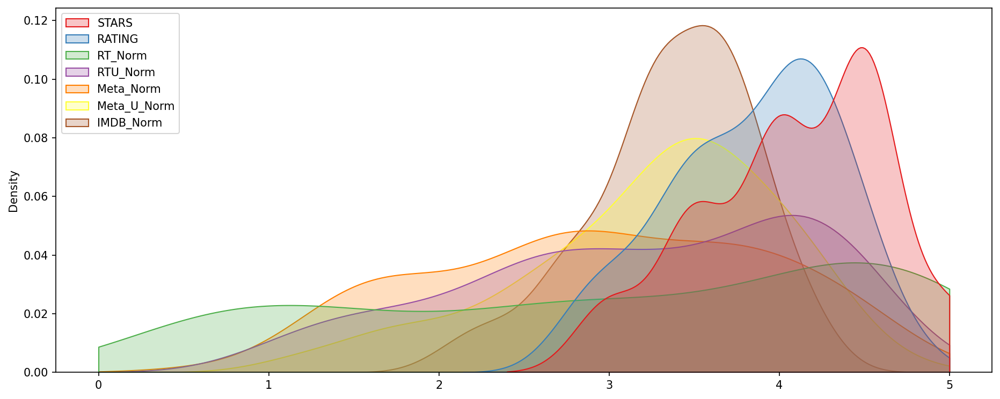
    


**Clearly Fandango has an uneven distribution. We can also see that RT critics have the most uniform distribution. Let's directly compare these two.** 

**Below is a KDE plot that compare the distribution of RT critic ratings against the STARS displayed by Fandango.**


```python
fig, ax = plt.subplots(figsize=(15,6), dpi=150)

sns.kdeplot(data=norm_scores[['RT_Norm', 'STARS']], clip=[0,5], shade=True, palette='Set1', ax=ax)

move_legend(ax, 'upper left')
plt.show()
```


    
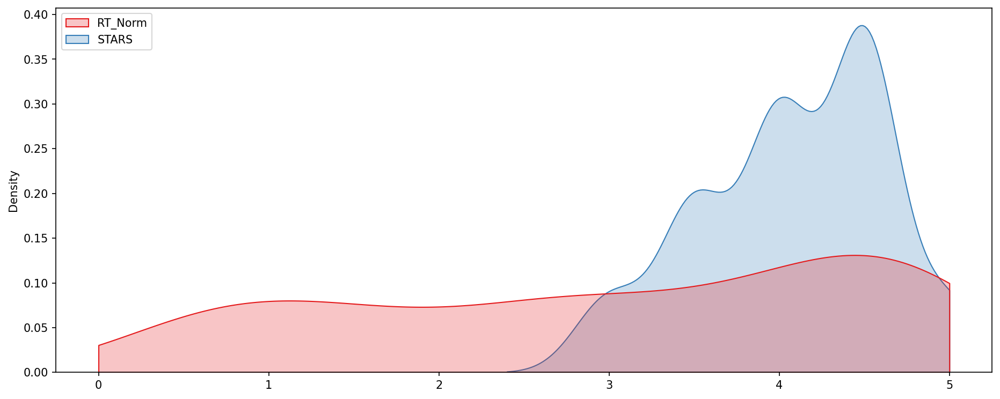
    


```python

```

**histplot comparing all normalized scores.**


```python
plt.subplots(figsize=(10,4), dpi=150)

sns.histplot(data=norm_scores, bins=50)

#move_legend(ax, 'upper left')
plt.show()
```


    
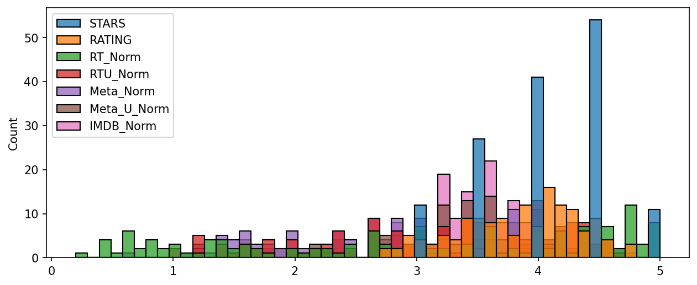
    


### How are the worst movies rated across all platforms?

**We'll use a clustermap to visualize all normalized scores. Note the differences in ratings, highly rated movies should be clustered together versus poorly rated movies**


```python
# CODE HERE
print(norm_scores.head())
sns.clustermap(data=norm_scores, cmap='magma', col_cluster=False)
```

       STARS  RATING  RT_Norm  RTU_Norm  Meta_Norm  Meta_U_Norm  IMDB_Norm
    0    4.0     3.9      1.2       2.1        2.3          1.6        2.1
    1    4.5     4.5      3.6       4.0        3.0          3.5        3.6
    2    5.0     4.8      3.6       4.2        3.6          3.3        3.7
    3    5.0     4.8      4.0       4.2        3.4          3.4        3.7
    4    4.5     4.5      4.9       4.5        4.7          4.4        4.3


    <seaborn.matrix.ClusterGrid at 0x7f95bb2f1b20>


    
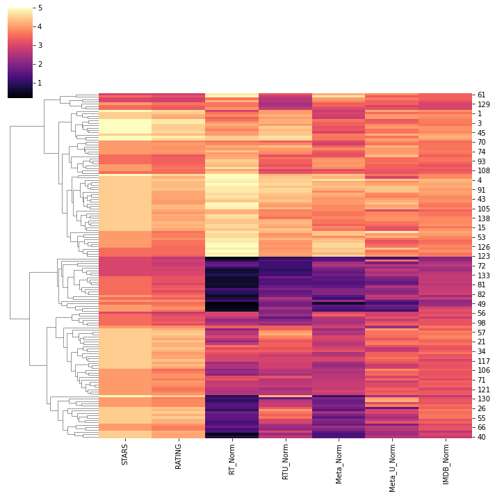
    


**Clearly Fandango is rating movies much higher than other sites, especially considering that it is then displaying a rounded up version of the rating. Let's examine the top 10 worst movies. Based off the Rotten Tomatoes Critic Ratings, what are the top 10 lowest rated movies? What are the normalized scores across all platforms for these movies?**


```python
norm_scores = df[['STARS', 'RATING', 'RT_Norm', 'RTU_Norm', 'Meta_Norm', 'Meta_U_Norm', 'IMDB_Norm', 'FILM']]
norm_scores.head()
```


<div>
<style scoped>
    .dataframe tbody tr th:only-of-type {
        vertical-align: middle;
    }

    .dataframe tbody tr th {
        vertical-align: top;
    }

    .dataframe thead th {
        text-align: right;
    }
</style>
<table border="1" class="dataframe">
  <thead>
    <tr style="text-align: right;">
      <th></th>
      <th>STARS</th>
      <th>RATING</th>
      <th>RT_Norm</th>
      <th>RTU_Norm</th>
      <th>Meta_Norm</th>
      <th>Meta_U_Norm</th>
      <th>IMDB_Norm</th>
      <th>FILM</th>
    </tr>
  </thead>
  <tbody>
    <tr>
      <th>0</th>
      <td>4.0</td>
      <td>3.9</td>
      <td>1.2</td>
      <td>2.1</td>
      <td>2.3</td>
      <td>1.6</td>
      <td>2.1</td>
      <td>Fifty Shades of Grey (2015)</td>
    </tr>
    <tr>
      <th>1</th>
      <td>4.5</td>
      <td>4.5</td>
      <td>3.6</td>
      <td>4.0</td>
      <td>3.0</td>
      <td>3.5</td>
      <td>3.6</td>
      <td>Jurassic World (2015)</td>
    </tr>
    <tr>
      <th>2</th>
      <td>5.0</td>
      <td>4.8</td>
      <td>3.6</td>
      <td>4.2</td>
      <td>3.6</td>
      <td>3.3</td>
      <td>3.7</td>
      <td>American Sniper (2015)</td>
    </tr>
    <tr>
      <th>3</th>
      <td>5.0</td>
      <td>4.8</td>
      <td>4.0</td>
      <td>4.2</td>
      <td>3.4</td>
      <td>3.4</td>
      <td>3.7</td>
      <td>Furious 7 (2015)</td>
    </tr>
    <tr>
      <th>4</th>
      <td>4.5</td>
      <td>4.5</td>
      <td>4.9</td>
      <td>4.5</td>
      <td>4.7</td>
      <td>4.4</td>
      <td>4.3</td>
      <td>Inside Out (2015)</td>
    </tr>
  </tbody>
</table>
</div>


```python
ten_smallest_RT_scores = norm_scores.nsmallest(10, 'RT_Norm')
ten_smallest_RT_scores
```


<div>
<style scoped>
    .dataframe tbody tr th:only-of-type {
        vertical-align: middle;
    }

    .dataframe tbody tr th {
        vertical-align: top;
    }

    .dataframe thead th {
        text-align: right;
    }
</style>
<table border="1" class="dataframe">
  <thead>
    <tr style="text-align: right;">
      <th></th>
      <th>STARS</th>
      <th>RATING</th>
      <th>RT_Norm</th>
      <th>RTU_Norm</th>
      <th>Meta_Norm</th>
      <th>Meta_U_Norm</th>
      <th>IMDB_Norm</th>
      <th>FILM</th>
    </tr>
  </thead>
  <tbody>
    <tr>
      <th>49</th>
      <td>3.5</td>
      <td>3.5</td>
      <td>0.2</td>
      <td>1.8</td>
      <td>0.6</td>
      <td>1.2</td>
      <td>2.2</td>
      <td>Paul Blart: Mall Cop 2 (2015)</td>
    </tr>
    <tr>
      <th>25</th>
      <td>4.5</td>
      <td>4.1</td>
      <td>0.4</td>
      <td>2.3</td>
      <td>1.3</td>
      <td>2.3</td>
      <td>3.0</td>
      <td>Taken 3 (2015)</td>
    </tr>
    <tr>
      <th>28</th>
      <td>3.0</td>
      <td>2.7</td>
      <td>0.4</td>
      <td>1.0</td>
      <td>1.4</td>
      <td>1.2</td>
      <td>2.0</td>
      <td>Fantastic Four (2015)</td>
    </tr>
    <tr>
      <th>54</th>
      <td>4.0</td>
      <td>3.7</td>
      <td>0.4</td>
      <td>1.8</td>
      <td>1.6</td>
      <td>1.8</td>
      <td>2.4</td>
      <td>Hot Pursuit (2015)</td>
    </tr>
    <tr>
      <th>84</th>
      <td>4.0</td>
      <td>3.9</td>
      <td>0.4</td>
      <td>2.4</td>
      <td>1.4</td>
      <td>1.6</td>
      <td>3.0</td>
      <td>Hitman: Agent 47 (2015)</td>
    </tr>
    <tr>
      <th>50</th>
      <td>4.0</td>
      <td>3.6</td>
      <td>0.5</td>
      <td>1.8</td>
      <td>1.5</td>
      <td>2.8</td>
      <td>2.3</td>
      <td>The Boy Next Door (2015)</td>
    </tr>
    <tr>
      <th>77</th>
      <td>3.5</td>
      <td>3.2</td>
      <td>0.6</td>
      <td>1.8</td>
      <td>1.5</td>
      <td>2.0</td>
      <td>2.8</td>
      <td>Seventh Son (2015)</td>
    </tr>
    <tr>
      <th>78</th>
      <td>3.5</td>
      <td>3.2</td>
      <td>0.6</td>
      <td>1.5</td>
      <td>1.4</td>
      <td>1.6</td>
      <td>2.8</td>
      <td>Mortdecai (2015)</td>
    </tr>
    <tr>
      <th>83</th>
      <td>3.5</td>
      <td>3.3</td>
      <td>0.6</td>
      <td>1.7</td>
      <td>1.6</td>
      <td>2.5</td>
      <td>2.8</td>
      <td>Sinister 2 (2015)</td>
    </tr>
    <tr>
      <th>87</th>
      <td>3.5</td>
      <td>3.2</td>
      <td>0.6</td>
      <td>1.4</td>
      <td>1.6</td>
      <td>1.9</td>
      <td>2.7</td>
      <td>Unfinished Business (2015)</td>
    </tr>
  </tbody>
</table>
</div>


```python

```

**Visualizing the distribution of ratings across all sites for the top 10 worst movies.**


```python
# CODE HERE
fig, ax = plt.subplots(figsize=(15,6), dpi=150)

sns.kdeplot(data=ten_smallest_RT_scores, clip=[0,5], shade=True, palette='Set1', ax=ax)

move_legend(ax, 'upper right')
plt.title("Ratings for RT Critic's 10 Worst Reviewed Films")
plt.show()
```


    
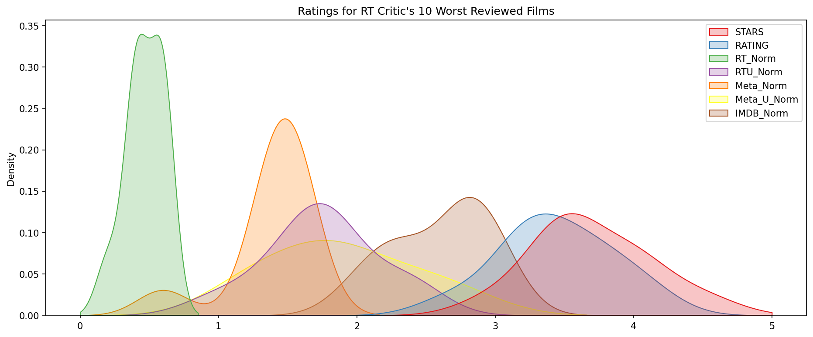
    


**Even when dealing with the worst rated movies from RT, we can see that Fandango shows much higher ratings on their platform, further requiring us to question the legitimacy of their business.**


```python

```
